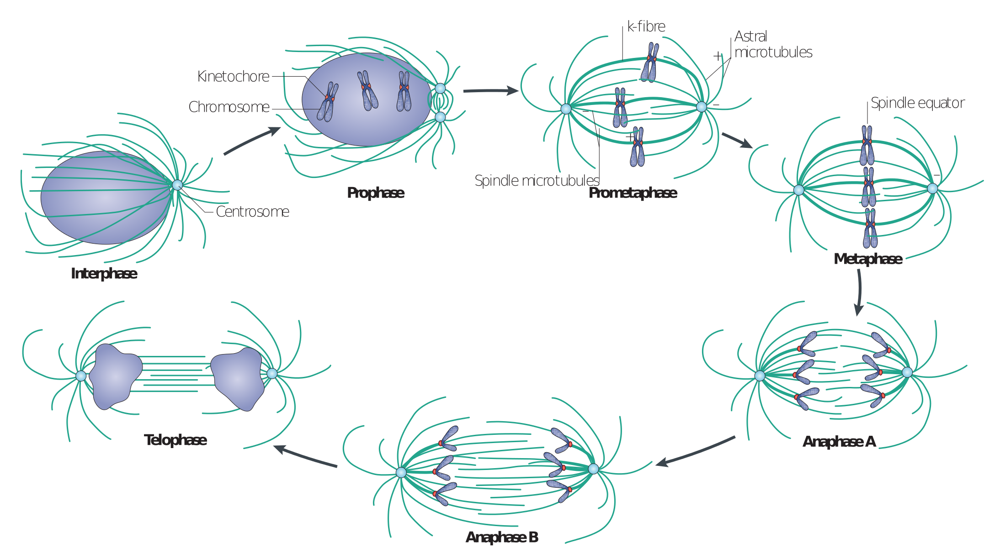

![Interphase and the different stages of mitosis. Figure from [@Walczak2010]\label{mitosis}](figures/mitosis_Walczak.png)

See Figure \ref{mitosis} for a schematic illustration.

You need to insert empty lines at the end of each section.....

test encore

The *Gamma function* satisfying $\Gamma(n) = (n-1)!\quad\forall
n\in\mathbb N$ is via through the Euler integral

$$
\Gamma(z) = \int_0^\infty t^{z-1}e^{-t}dt\,.
$$

 **Chia Huei Tan**^1,2^ and Patrick Meraldi^1,2^

\small ^1^ Institute of Biochemistry, ETH Zurich, CH-8093 Zurich, Switzerland
\newline
\small ^2^ Department of Physiology and Metabolism, Medical Faculty, University of Geneva, CH-1211 Geneva 4, Switzerland
\newline

\pagebreak

  Right     Left     Center     Default
-------     ------ ----------   -------
     12     12        12            12
    123     123       123          123
      1     1          1             1

\begin{figure}[h]
\centering
\includegraphics{figures/FigureY.pdf}
\caption{\textbf{This figure is about Y} (A) First subfigure. (B) Second subfigure.}
\end{figure}

vfill command will ensure that if your text is too short and doesn't fill up the entire page, it won't get spread out till the bottom.

\vfill
